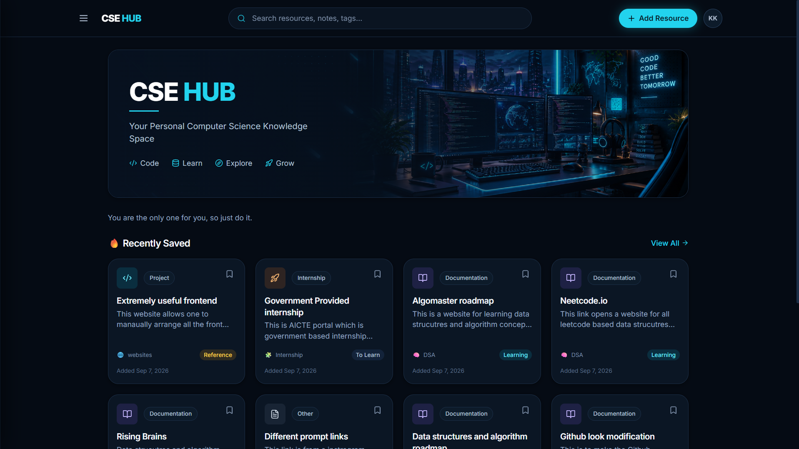
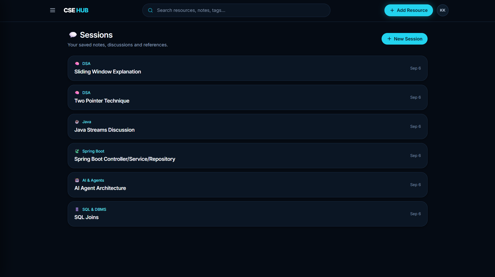
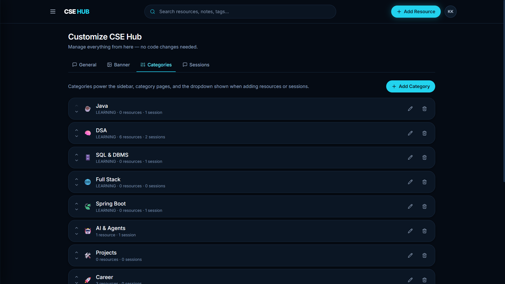

# CSE Hub

> A personal Computer Science knowledge-management platform to save, organize, and revisit everything I learn.

CSE Hub is a full-stack web application built to organize my Computer Science learning resources, notes, sessions, courses, project ideas, internships, hackathons, certifications, and other useful references in one centralized workspace.

Instead of keeping resources scattered across bookmarks, messages, documents, and different platforms, CSE Hub provides a single place to manage and revisit them.

---

## Features

- Organize resources into customizable categories
- Save external learning resources and links
- Upload and manage PDFs, PowerPoint files, and images
- Add custom thumbnails and cover images
- Create and manage personal learning sessions and notes
- Search resources, sessions, and tags
- Add tags and resource statuses
- Browse all saved resources from a centralized view
- Customize the homepage, banner, motivational text, and categories
- Persist application data using MySQL
- Modern dark futuristic UI with responsive design

---

## 🖥️ Screenshots

### Home



### All Resources


### Sessions



### Customize CSE Hub



### Add Resource


---

## 🛠️ Tech Stack

### Frontend

- React
- TypeScript
- Vite
- Tailwind CSS
- React Router
- Axios
- Lucide React

### Backend

- Java
- Spring Boot
- Spring Data JPA
- Maven
- REST APIs

### Database

- MySQL

---

## 🏗️ Architecture

```text
CSE Hub
│
├── frontend/
│   ├── React + TypeScript
│   ├── Vite
│   ├── Tailwind CSS
│   └── REST API integration
│
├── backend/
│   ├── Spring Boot
│   ├── REST Controllers
│   ├── Services
│   ├── JPA Repositories
│   └── MySQL integration
│
└── docs/
    └── images/
        └── Project screenshots
```
